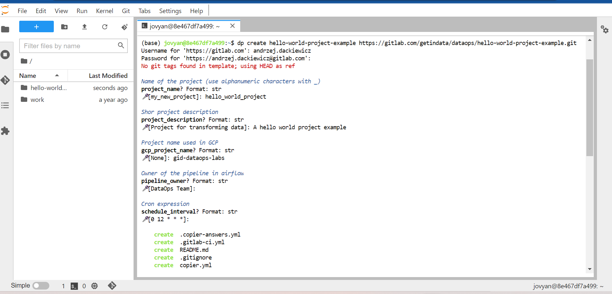
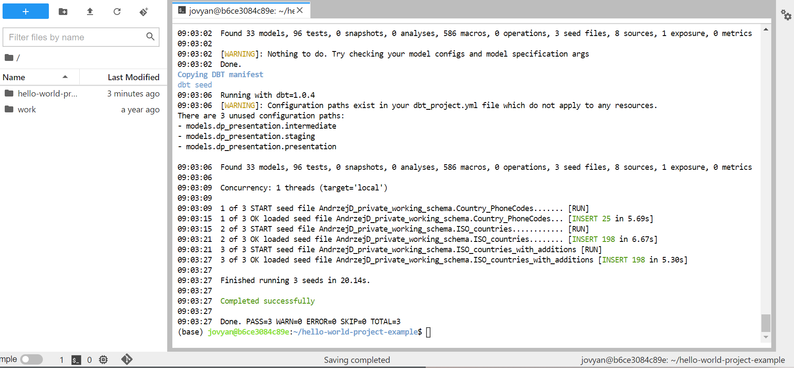
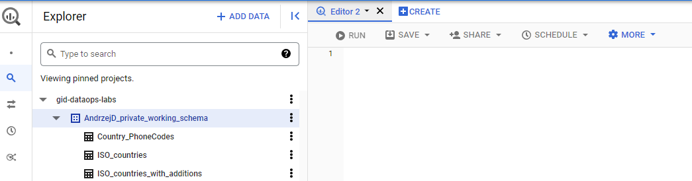
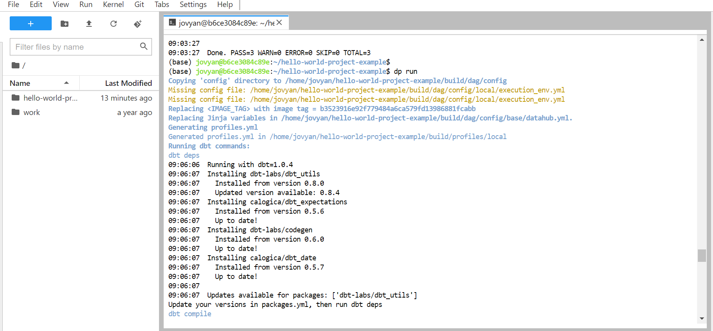
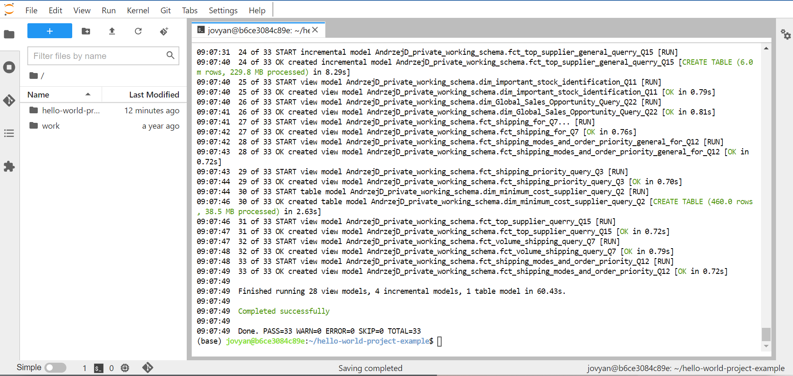
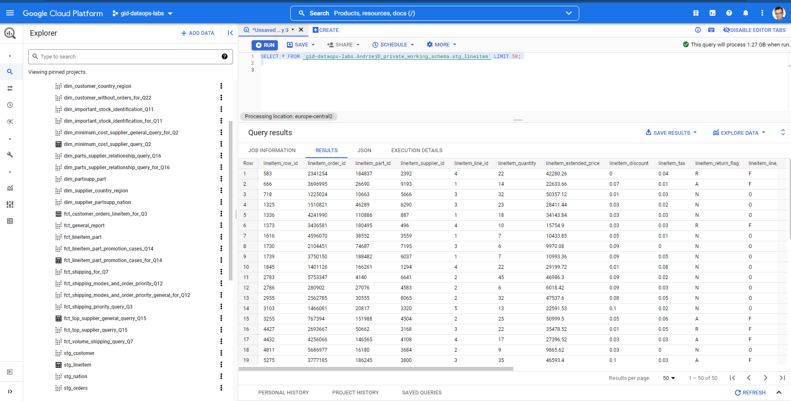
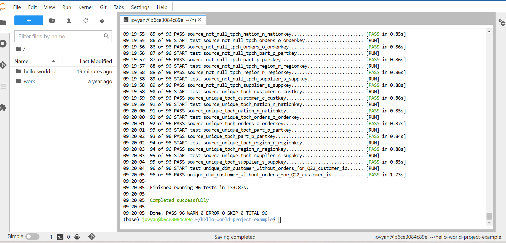

# TCP-H Data Pipelines Demo

This is an example of a Data Pipelines project that has data pipelines simulating operations of a fictional company.
The purpose is to show you how an advanced Data Pipelines project can look like. This project can be used as an example
when you work on your Data Pipelines project.
You can see the contents of the repository and see how models and tests look like, so that the process of implementation
in your project is easier.

This is an advanced example of a project. If you want to see a simple example of a Data Pipelines project check [here](https://github.com/getindata/first-steps-with-data-pipelines).

## Environment preparation

Here we will explain how to make it possible to use Data Pipelines on an instance of 
GCP Vertex AI JupyterLab notebook.

Go to Vertex AI on GCP console. On the menu choose Workbench. You should be able to see currently existing Notebooks.
For purpose of this example create a new notebook. We will be using our publically available environment image.

Click new Notebook button. There choose "Customize...". Name your notebook, specify Region and Zone
and for environment scrollbar choose "Custom container" option.
Then for docker container image paste the image:
```
gcr.io/getindata-images-public/jupyterlab-dataops:bigquery-1.0.5
```

You can configure the rest of the parameters or leave them as they are.
When you are done click Create button. After some time an instance of Notebook with
proper image installed should be available and we should be able to start setting up
the environment.

## Data used

For the purpose of this demo we used data from TCP-H, which is a set of data sets that are used for benchmarking of
decision support systems. This project simulates data and processes of a fictional company.

## Setting up DP

We expect that the whole organization will be using the same Data Pipeline initialization project that specifies which
templates (DP projects) they are using.

Before you start using DP you should first initialize it:
```
dp init <path to init repo>
```

If this if your first DP project and you do not have your own templates of projects then
here is an example of a publically available DP init repository that you can use:
```
dp init https://github.com/getindata/data-pipelines-cli-init-example
```

You can add more options to dp.yml file with other templates of projects to choose from. Specify their template_names
and the template_paths to git repositories. You can also specify more vars for use in your projects.
The example initialization asks about the name of user, this name will be later used in other operations but 
you typically have to run init command only once.

## Creation of our project

After the initialization is complete we can start using DP to create projects with project templates.

```
dp create <project path> <template path> 
```

Project path is a location where we want our project to be created. Usually this is just a directory name.
Here is an example of a publically available template of a DP project:
```
https://github.com/getindata/data-pipelines-template-example
```

Here, we will be asked some questions about which template to use for a new project, the name of the Data Pipelines project,
the id of GCP project that we are working on, the cron that specifies at what times should the DP pipeline run and a
description of the created project.

Be aware that the name of the Data Pipelines project should be written using alpha-numeric signs plus the underscore sign.

After answering these questions Copier will be used to create contents of our projects using the specified project template.



## Running pipelines and tests using Data Pipeline tool

This project contains some seeds, models and tests that were added to simulate how pipelines could look like at an organization.
To understand more about models, tests and seeds please read about them at the
[DBT Documentation](https://docs.getdbt.com/docs/building-a-dbt-project/documentation).

Here is an example of what output of this command can look like based on the contents of this repository.

```
dp seed
```



In this repository there are 3 CSV files specified that contain some data. 
After running this command the tables with contents of CSV files will be created in a BigQuery dataset.
The name of the dataset to put results into is a result of schema name generation. The name of user we specify in
initialization step is used in this process.

Below is a picture of the contents of 3 tables generated in BigQuery based on the seed CSV files:


The contents of these tables can be used in some of the models that we specify.
Now we should be ready to run our models:

```
dp run
```





This process will look at the contents of the models directory and create coresponding tables or views in our BigQuery Dataset:



Now after all the tables and views are created we can also check, if the models work as intended by running the tests:

```
dp test
```



We should be able to see the summary, we can see if everything is fine or there is an error with a specific test.

### Resources:

- More about [data-pipelines-cli](https://data-pipelines-cli.readthedocs.io/en/latest/usage.html#)
- Learn more about dbt [in the docs](https://docs.getdbt.com/docs/introduction)
- Check out [Discourse](https://discourse.getdbt.com/) for commonly asked questions and answers
- Understand [Copier](https://copier.readthedocs.io/en/stable/)
- Try [Airlfow](https://airflow.apache.org/)
- Data used [TCP](https://www.tpc.org/tpch/)
